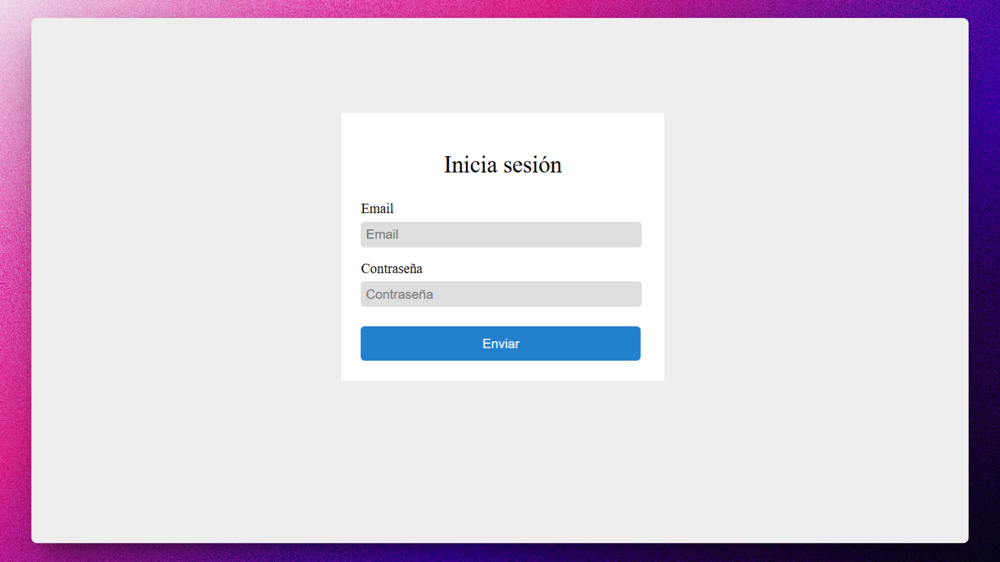
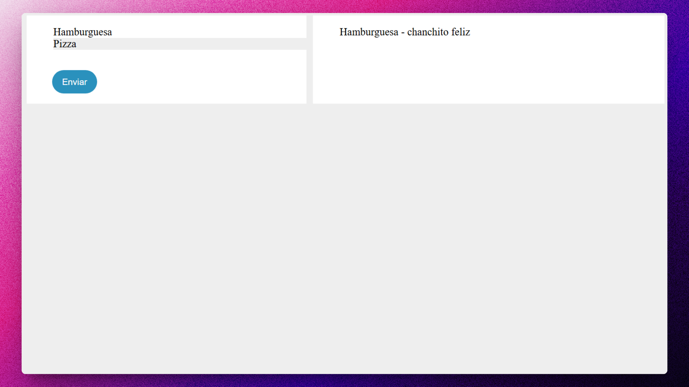
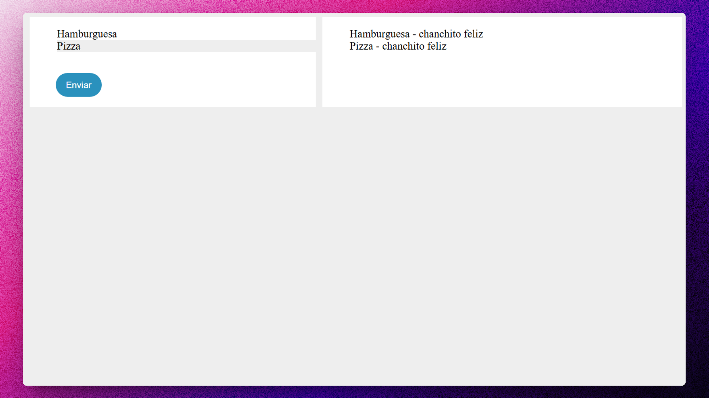

  
# 🍕 HTML/CSS/JS: Almuerzi Web

### Aplicación para consumir una API Rest vanilla.

> 🧩 Aquí puedes ver su [**Live Demo.**](https://almuerzi-abrahamgalue.netlify.app/)

## 🚀 Descripción

Este proyecto te permite logearte con una cuenta y agregar ordenes de comida.

Esta hecha para consumir de manera vanilla una API que esta hecha con Express.js y MongoDB.